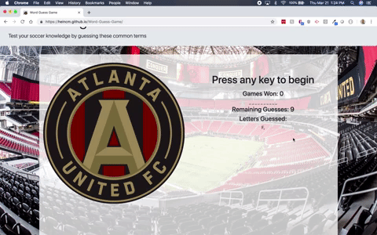
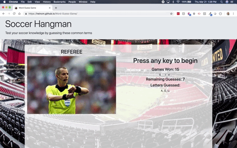
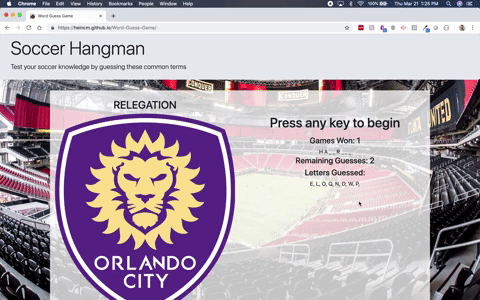

# Word-Guess-Game
Thanks for checking out my first javascript project for my coding bootcamp. 

The game is played solely with the keyboard. Pushing any key will either result in revealing a letter of the word you are trying to guess, or you will see your keystroke show up in the "Letters Guessed" area to help you keep track of incorrect guesses and the number of remaining guesses will decrease.

### Winning

To win the game, you must correctly guess all of the letters in the soccer term that is blank. Upon guessing all letters correctly, you will see a picture and text of the word you just guessed. 

The page will keep track of the number of games you have won. The game will also automatically reset upon winning and you can play again by simply making another guess on the keyboard.  

Should you guess all the word correctly, you'll see a special game winning image at the top of the screen.

### Losing

Should you run out of guesses before correctly guessing the word, you will see a picture and text notifying you that you have lost. 

The game will automatically reset upon losing and you can play again by simply making another guess on the keyboard. 

### Theme Inspiration

I love soccer, and I'm a huge Atlanta United fan. This project gave me a fun way to show my love for the team while getting my homework done. 
